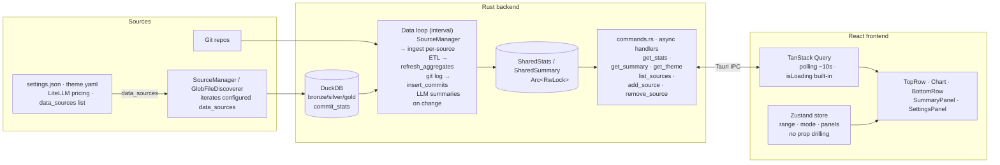

# LOC Dock

Floating desktop widget that tracks your daily dev metrics at a glance.


[](LICENSE)
[](https://tauri.app)
[](https://react.dev)
[](https://tanstack.com/query)
[](https://zustand-demo.pmnd.rs)
[](https://www.rust-lang.org)
[](https://duckdb.org)


## What it shows

- **LOC changes** -- lines added/deleted across all git repos today
- **Token usage** -- Claude Code input, output, cache write, cache read totals
- **Cost estimate** -- dollar cost breakdown with hover tooltip
- **Session counts** -- active and today's Claude Code sessions

Three chart modes (click to toggle):
- **LOC** -- stacked bar chart of additions (green) and deletions (red)
- **COST** -- cost over time (purple)
- **TOKENS** -- stacked token types: IN (white), OUT (pink), CW (yellow), CR (blue)

## Features

- Always-on-top, borderless, semi-transparent
- Draggable with snap-to-corner (pin menu for all 4 corners)
- Resizable -- drag edges/corners to resize, responsive layout collapses at small sizes
- Day/Week toggle for all stats
- System tray with Show/Hide/Quit
- Settings panel (cog icon) with sticky save/back header
- **Single-instance guard** -- PID lock file + named-mutex plugin prevents duplicate processes
- **Config hot-reload** -- save settings without restarting the app
- **Multi-source data adapters** -- Claude Code, Pi, and Codex CLI (add your own via settings UI)
- **LiteLLM pricing** -- 2,800+ model prices from the community-maintained LiteLLM JSON
- **LLM summaries** -- optional AI-generated commit summaries per repo (DeepSeek/OpenAI-compatible)
- Customizable theme via YAML
- Auto-creates default theme on first launch

## Install

Download the latest installer for your platform from the [Releases page](https://github.com/evanokeefe39/loc-dock/releases).

| Platform | Format |
|----------|--------|
| Windows  | `.exe` (NSIS installer) |
| macOS    | `.dmg` |
| Linux    | `.AppImage` / `.deb` |

The installers are not code-signed. On Windows, SmartScreen may show a warning — click "More info" then "Run anyway". On macOS, right-click the app and choose "Open" on first launch.

## Development

### Requirements

- [Node.js](https://nodejs.org) 18+
- [Rust](https://rustup.rs) 1.70+
- Git on PATH

### Quick start

```bash
git clone https://github.com/evanokeefe39/loc-dock.git
cd loc-dock/loc-dock-tauri
npm install
npm run tauri dev
```

First build takes 3-5 minutes (DuckDB compiles from source). Subsequent builds are fast.

### Build for production

```bash
npm run tauri build
```

Produces a native installer in `src-tauri/target/release/bundle/`.

### Releasing

1. Bump version: `./scripts/bump-version.sh 0.2.0`
2. Commit: `git commit -am "chore: bump version to 0.2.0"`
3. Tag: `git tag v0.2.0`
4. Push: `git push origin master --tags`

GitHub Actions builds installers for all platforms and creates a draft release. Review and publish on the [Releases page](https://github.com/evanokeefe39/loc-dock/releases).

## Configuration

Settings are accessible via the cog icon in the widget, or by editing `~/.config/loc-dock/settings.json`. On first launch, Loc-Dock also reads legacy `.env` variables and auto-populates `settings.json`.

| Key | Default | Description |
|---|---|---|
| `repos_dir` | `~/repos` | Directory containing your git repositories |
| `timezone` | `Europe/Berlin` | IANA timezone for day boundary |
| `day_start_hour` | `7` | Hour when "today" starts (24h) |
| `week_start_day` | `0` | Day week starts (0=Mon, 6=Sun) |
| `theme_path` | `~/.config/loc-dock/theme.yaml` | Path to theme file |
| `autostart` | `false` | Launch on Windows startup |
| `data_sources` | Auto-detected | List of (adapter, path) pairs — Claude, Pi, Codex CLI |
| `model_pricing_path` | *(bundled)* | Optional override to LiteLLM pricing JSON |

## Theming

Edit `~/.config/loc-dock/theme.yaml` to customize colors and transparency. A default theme is created automatically on first launch. All fields are optional.

```yaml
alpha: 0.92              # window transparency (0.0-1.0)
bg: "#202020"            # main background
chart_bg: "#181818"      # chart background
tooltip_bg: "#2a2a2a"    # cost tooltip background
text: "#e0e0e0"          # primary text
text_dim: "#6b7280"      # secondary text, labels
axis: "#333333"          # chart axis lines
loc_add: "#34d399"       # lines added (green)
loc_del: "#ef4444"       # lines deleted (red)
cost: "#a78bfa"          # cost label and chart (purple)
sessions: "#f97316"      # active sessions (orange)
tok_input: "#e0e0e0"     # input tokens
tok_output: "#f472b6"    # output tokens (pink)
tok_cache_write: "#facc15"  # cache write (yellow)
tok_cache_read: "#38bdf8"   # cache read (blue)
```

You can maintain multiple theme files and switch between them via the settings panel.

## Architecture

> See [docs/DATA_FLOWS.md](docs/DATA_FLOWS.md) for detailed end-to-end data flow
> diagrams showing how each metric moves from source files to the dock UI.

The Rust backend owns all data; the React frontend is a pure renderer. A single
background loop runs git scan + DuckDB ETL + LLM summaries and writes results into
shared in-memory state. The frontend polls that state via TanStack Query over async
Tauri commands — it never touches data sources and never blocks on a slow backend.
UI state (range, mode, panels) lives in a Zustand store accessible to any component
without prop drilling.



### Data path (medallion ETL)

`usage_store.rs` treats DuckDB as the ETL engine; Rust is thin orchestration. Session
JSONL from any configured source (Claude, Pi, Codex CLI via `source_adapter.rs`)
flows through three layers:

- **Bronze** — ephemeral `read_ndjson_objects` CTE reads raw JSONL via glob with zero
  schema inference (auto-inference OOM-crashes on heterogeneous logs).
- **Silver** — one `INSERT ... SELECT` per source maps bronze into the canonical
  `entries` table: typed fields extracted by JSON path, cost flat-priced per model
  via LiteLLM pricing JSON, deduped by `(source, session_id, ts)`.
- **Gold** — `daily_aggregates`, a materialized per-date/per-source rollup that the
  serving queries read.

Ingestion is incremental: an `ingested_files (path, mtime, size)` registry means each
cycle only re-reads files that changed. Cold starts micro-batch the full glob to cap
JSON-parse memory.

### Control path

The data loop (`data.rs`) scans git incrementally (`git.rs`, queries `MAX(ts)` from
`commit_stats`, runs `git log --after={ts}` — typically 0–5 new commits, <100ms),
runs the ETL, and builds `AllStats` for day/week/month/year ranges into a shared
`RwLock`. On each cycle it checks each repo's `head_sha` against the `repo_summaries`
table and calls the LLM only for repos whose SHA changed — summaries are driven by the
data loop, not an independent thread.

Tauri commands (`get_stats`, `get_summary`) are `async` and only read shared state,
so the dock stays responsive regardless of backend work. The frontend uses **TanStack
Query** to poll those commands (~10s interval), providing built-in `isLoading` states,
stale-while-revalidate, and cache dedup. **Zustand** holds UI-pure state (range, mode,
panel visibility) so no component needs to thread props through the tree.

The database connection is opened once in `lib.rs` and shared via `try_clone()`.
Config is stored as `Arc<RwLock<Config>>` — settings save to disk and reload instantly
without restarting. The `restart_app` command is a no-op; under `npm run tauri dev`
this keeps the dev watcher alive.

## How it works

1. **Single-instance check** — PID lock file (`instance.lock`) + `tauri-plugin-single-instance`
2. **Prefill** — On startup, the data loop queries `daily_aggregates` + `commit_stats` for all
   four time ranges (day/week/month/year) and writes them to shared state. First paint in <50ms
   with real data on warm start; shows loading spinner on cold start.
3. **Incremental git scan** — Queries `MAX(ts)` from the `commit_stats` table, then runs
   `git log --after={ts}` on each repo. Typically 0–5 new commits, <100ms total. Never
   re-scans past commits.
4. **DuckDB ETL** — Ingests changed JSONL files from all configured data sources
   (Claude, Pi, Codex CLI, etc.) through bronze → silver → gold.
   Cost is flat-priced per model using LiteLLM's pricing JSON (2,800+ models).
   Deduped by `(source, session_id, ts)`. Retries `Connection::open` with backoff
   and WAL cleanup if the previous process crashed.
5. **LLM summaries on change** — For each repo with new commits, checks `head_sha` against
   the `repo_summaries` table. Only calls the LLM when SHA changed. Cached highlights are
   served from the DB.
6. **Frontend poll** — TanStack Query polls `get_stats` / `get_summary` every 10s.
   Built-in `isLoading` states avoid the "zeros until loaded" problem. Background refetches
   don't flash — stale data stays visible while the new fetch completes.
7. **Settings hot-reload** — `save_settings` writes `settings.json` to disk and reloads
   the shared `Arc<RwLock<Config>>`. Background loops pick up changes on the next cycle.
   No restart needed.

## License

[MIT](LICENSE)
