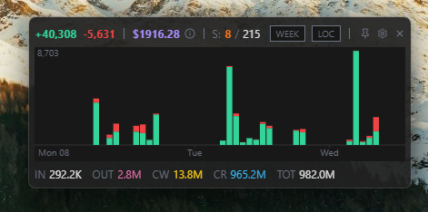
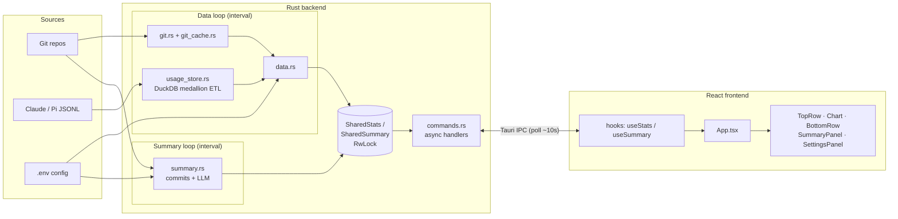

# LOC Dock

Floating desktop widget that tracks your daily dev metrics at a glance.



[](LICENSE)
[](https://tauri.app)
[](https://react.dev)
[](https://www.rust-lang.org)
[](https://duckdb.org)


## What it shows

- **LOC changes** -- lines added/deleted across all git repos today
- **Token usage** -- Claude Code input, output, cache write, cache read totals
- **Cost estimate** -- dollar cost breakdown with hover tooltip
- **Session counts** -- active and today's Claude Code sessions

Three chart modes (click to toggle):
- **LOC** -- stacked bar chart of additions (green) and deletions (red)
- **COST** -- cost over time (purple)
- **TOKENS** -- stacked token types: IN (white), OUT (pink), CW (yellow), CR (blue)

## Features

- Always-on-top, borderless, semi-transparent
- Draggable with snap-to-corner (pin menu for all 4 corners)
- Resizable -- drag edges/corners to resize, responsive layout collapses at small sizes
- Day/Week toggle for all stats
- System tray with Show/Hide/Quit
- Settings panel (cog icon) for repos dir, claude dir, timezone, day/week start
- Customizable theme via YAML
- Auto-creates default theme on first launch

## Install

Download the latest installer for your platform from the [Releases page](https://github.com/evanokeefe39/loc-dock/releases).

| Platform | Format |
|----------|--------|
| Windows  | `.exe` (NSIS installer) |
| macOS    | `.dmg` |
| Linux    | `.AppImage` / `.deb` |

The installers are not code-signed. On Windows, SmartScreen may show a warning — click "More info" then "Run anyway". On macOS, right-click the app and choose "Open" on first launch.

## Development

### Requirements

- [Node.js](https://nodejs.org) 18+
- [Rust](https://rustup.rs) 1.70+
- Git on PATH

### Quick start

```bash
git clone https://github.com/evanokeefe39/loc-dock.git
cd loc-dock/loc-dock-tauri
npm install
npm run tauri dev
```

First build takes 3-5 minutes (DuckDB compiles from source). Subsequent builds are fast.

### Build for production

```bash
npm run tauri build
```

Produces a native installer in `src-tauri/target/release/bundle/`.

### Releasing

1. Bump version: `./scripts/bump-version.sh 0.2.0`
2. Commit: `git commit -am "chore: bump version to 0.2.0"`
3. Tag: `git tag v0.2.0`
4. Push: `git push origin master --tags`

GitHub Actions builds installers for all platforms and creates a draft release. Review and publish on the [Releases page](https://github.com/evanokeefe39/loc-dock/releases).

## Configuration

Settings are accessible via the cog icon in the widget, or by editing `~/.config/loc-dock/.env`:

| Variable | Default | Description |
|---|---|---|
| `LOCDOCK_REPOS_DIR` | `~/repos` | Directory containing your git repositories |
| `LOCDOCK_CLAUDE_DIR` | `~/.claude` | Claude Code data directory |
| `LOCDOCK_TIMEZONE` | `Europe/Berlin` | IANA timezone for day boundary |
| `LOCDOCK_DAY_START_HOUR` | `7` | Hour when "today" starts (24h) |
| `LOCDOCK_WEEK_START_DAY` | `0` | Day week starts (0=Mon, 6=Sun) |
| `LOCDOCK_THEME_PATH` | `~/.config/loc-dock/theme.yaml` | Path to theme file |

## Theming

Edit `~/.config/loc-dock/theme.yaml` to customize colors and transparency. A default theme is created automatically on first launch. All fields are optional.

```yaml
alpha: 0.92              # window transparency (0.0-1.0)
bg: "#202020"            # main background
chart_bg: "#181818"      # chart background
tooltip_bg: "#2a2a2a"    # cost tooltip background
text: "#e0e0e0"          # primary text
text_dim: "#6b7280"      # secondary text, labels
axis: "#333333"          # chart axis lines
loc_add: "#34d399"       # lines added (green)
loc_del: "#ef4444"       # lines deleted (red)
cost: "#a78bfa"          # cost label and chart (purple)
sessions: "#f97316"      # active sessions (orange)
tok_input: "#e0e0e0"     # input tokens
tok_output: "#f472b6"    # output tokens (pink)
tok_cache_write: "#facc15"  # cache write (yellow)
tok_cache_read: "#38bdf8"   # cache read (blue)
```

You can maintain multiple theme files and switch between them via the settings panel.

## Architecture

The Rust backend owns all data; the React frontend is a pure renderer. Two
independent background loops compute stats and write them into shared in-memory
state. The frontend polls that state via async Tauri commands -- it never touches
data sources and never blocks on a slow backend.



### Data path (medallion ETL)

`usage_store.rs` treats DuckDB as the ETL engine; Rust is thin orchestration. Session
JSONL flows through three layers:

- **Bronze** -- ephemeral `read_ndjson_objects` CTE reads raw JSONL via glob with zero
  schema inference (auto-inference OOM-crashes on heterogeneous logs).
- **Silver** -- one `INSERT ... SELECT` per source maps bronze into the canonical
  `entries` table: typed fields extracted by JSON path, cost flat-priced as a column,
  deduped by `(source, session_id, ts)`.
- **Gold** -- `daily_aggregates`, a materialized per-date/per-source rollup that the
  serving queries read.

Ingestion is incremental: an `ingested_files (path, mtime, size)` registry means each
cycle only re-reads files that changed. Cold starts micro-batch the full glob to cap
JSON-parse memory.

### Control path

The data loop scans git (`git.rs`, cached per-repo SHA/ts in `git_cache.rs`), runs the
ETL, builds `AllStats` for day/week ranges, and writes it to a shared `RwLock`. The
summary loop independently collects recent commits and calls an LLM for a written
summary, writing to its own shared state. Tauri commands (`get_stats`, `get_summary`)
are `async` and only read shared state, so the dock stays responsive regardless of
backend work.

## How it works

1. Data loop scans every git repo in `REPOS_DIR` for commits since week start (cached, incremental per repo)
2. DuckDB ingests changed Claude/Pi JSONL files through bronze -> silver -> gold, deduped by message key
3. Stats (tokens, cost, sessions, chart buckets) are precomputed for day and week and stored in shared state
4. The summary loop separately summarizes recent commits via LLM into shared state
5. Frontend polls `get_stats` / `get_summary` (~10s) and renders the active range -- no queries on toggle

## License

[MIT](LICENSE)
