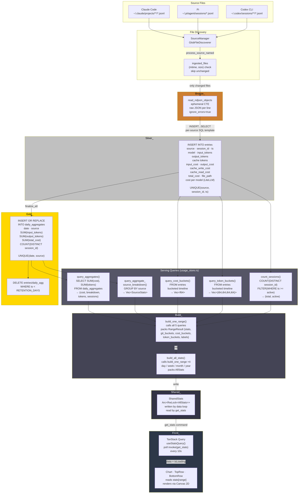
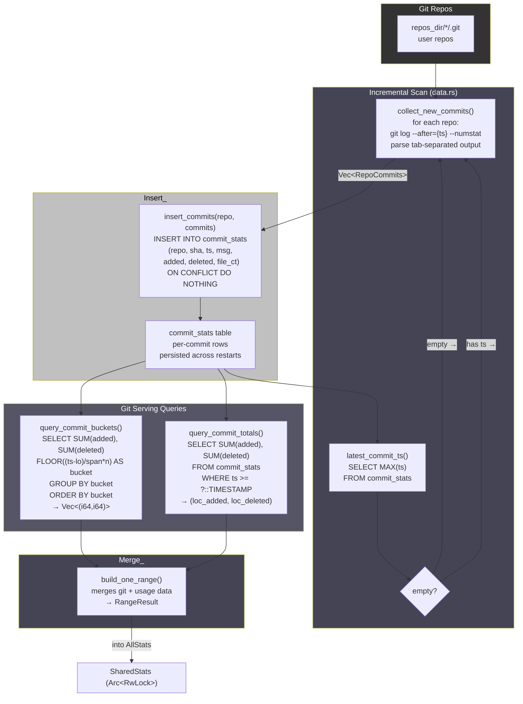
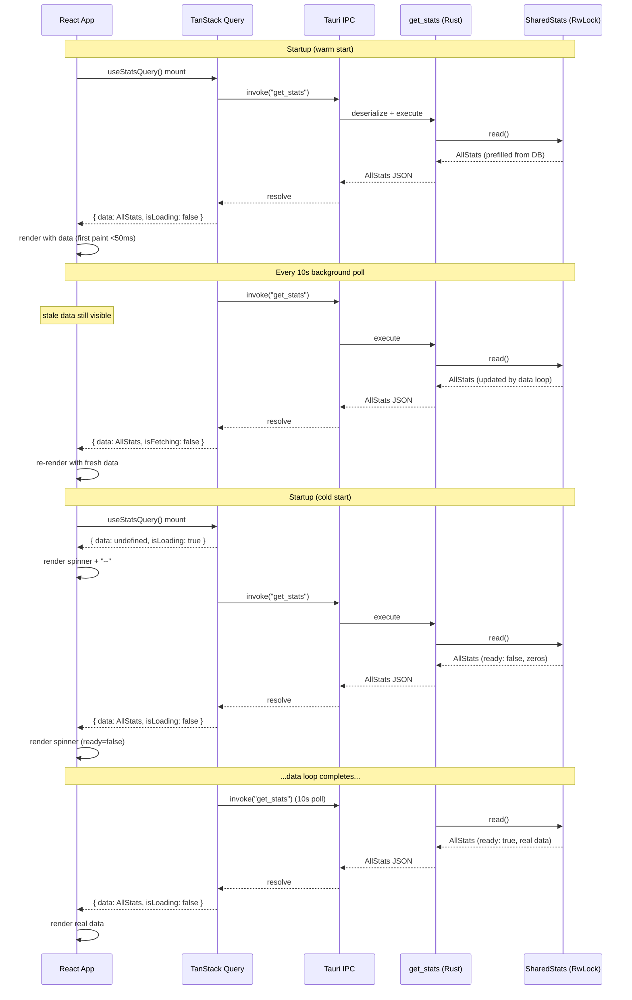

# Data Flows

How data moves from source files to the dock UI. Five independent pipelines,
all driven by the single data loop in `data.rs::spawn_data_loop`.

**Legend:**
```
SOURCE ──► DuckDB table ──► Rust struct ──► Tauri IPC ──► Frontend
```

---

## Medallion Architecture Overview

```mermaid
flowchart TD
    subgraph Sources["Source Files (immutable logs)"]
        JSONL["Claude / Pi / Codex JSONL\n~/.claude/**/*.jsonl\n~/.pi/agent/sessions/*.jsonl\n~/.codex/sessions/**/*.jsonl"]
        GIT["Git repos\nrepos_dir/*/.git"]
    end

    subgraph Bronze["Bronze — Raw Landing"]
        BRONZE_CTE["read_ndjson_objects CTE\nephemeral per batch\nno schema inference\nraw JSON per line"]
    end

    subgraph Silver["Silver — Cleaned & Typed"]
        ENTRIES["entries table\nUNIQUE(source, session_id, ts)\nfields by JSON path\ncost per model (LiteLLM)\ndeduped ON CONFLICT"]
        COMMIT_STATS["commit_stats table\nUNIQUE(repo, sha)\nincremental git log\nper-commit LOC counts"]
    end

    subgraph Gold["Gold — Serving Aggregates"]
        DAILY_AGG["daily_aggregates table\nper-date, per-source rollup\nSUM tokens, cost, sessions, LOC\nrefreshed when rows grow"]
        SUMMARY_CACHE["repo_summaries table\ncached LLM highlights\nkeyed by repo_path\ncompared to head_sha"]
    end

    subgraph Serving["Rust Serving Queries"]
        QUERIES["usage_store.rs\nquery_aggregates()\nquery_cost_buckets()\nquery_commit_buckets()\ncount_sessions()\nbuild_one_range()"]
        SUMMARY_BUILD["build_summary_data()\nall_repos_with_commits\n+ all_summarized_repos" ]
    end

    subgraph Shared["Shared In-Memory State"]
        ALLSTATS["AllStats\nArc&lt;RwLock&gt;"]
        SUMMDATA["SummaryData\nArc&lt;RwLock&gt;"]
    end

    subgraph Frontend["React Frontend"]
        TQ["TanStack Query\nuseStatsQuery\nuseSummaryQuery"]
        ZS["Zustand store\nrange / mode / panels"]
        UI["TopRow · Chart · BottomRow\nSummaryPanel · SettingsPanel"]
    end

    JSONL -->|ingested_files\nregistry filter| BRONZE_CTE
    BRONZE_CTE -->|INSERT...SELECT\nper-source SQL templates| ENTRIES
    ENTRIES -->|finalize_etl()\nrefresh_aggregates| DAILY_AGG

    GIT -->|git log --after\ncollect_new_commits| COMMIT_STATS
    COMMIT_STATS -->|head_sha check\nchange detection| SUMMARY_CACHE

    DAILY_AGG -->|query_aggregates\nadditive measures| QUERIES
    ENTRIES -->|query_cost_buckets\nnon-additive measures| QUERIES
    COMMIT_STATS -->|query_commit_buckets| QUERIES
    SUMMARY_CACHE ---> SUMMARY_BUILD

    QUERIES -->|build_all_stats ×4\nday/week/month/year| ALLSTATS
    SUMMARY_BUILD -->|Tauri event\n+ shared state| SUMMDATA

    ALLSTATS -->|get_stats command| TQ
    SUMMDATA -->|get_summary command\n+ summary-update event| TQ
    TQ ---> UI
    ZS ---> UI

    style Bronze fill:#CD7F32,color:#000
    style Silver fill:#C0C0C0,color:#000
    style Gold fill:#FFD700,color:#000
    style Sources fill:#333,color:#fff
    style Shared fill:#444,color:#fff
    style Frontend fill:#2d3748,color:#fff
```

### Layer contracts

| Layer | Table/CTE | What it stores | How it's populated | How it's read |
|-------|-----------|----------------|--------------------|---------------|
| **Bronze** | `read_ndjson_objects` (CTE) | Raw JSON per line, no schema | DuckDB glob of JSONL files on each batch | Silver `INSERT...SELECT` extracts by path |
| **Silver** | `entries` | Typed rows: source, session_id, ts, tokens, cost (all fields) | `INSERT...SELECT` per-source SQL templates, deduped | Gold aggregates; serving queries for buckets & sessions |
| **Silver** | `commit_stats` | Per-commit: repo, sha, ts, msg, added, deleted | Rust parses `git log --numstat`, inserts with ON CONFLICT DO NOTHING | Bucket queries for git timeline; latest_commit_ts for incremental scan |
| **Gold** | `daily_aggregates` | Per-date, per-source: SUM(tokens), SUM(cost), SUM(LOC), session_count | `refresh_aggregates()`: INSERT OR REPLACE ... SELECT | `query_aggregates()` for totals; prefill on startup |
| **Gold** | `repo_summaries` | Cached LLM highlights per repo: sha, json, model, timestamp | `save_repo_summary()` after LLM response | `build_summary_data()` for SummaryPanel |

---

## 1. Usage Data Flow (JSONL → Cost / Tokens / Sessions)



**Detailed path:**

```
~/.claude/projects/**/*.jsonl        ◄── Claude Code writes session logs here
~/.pi/agent/sessions/*.jsonl         ◄── Pi writes session logs here
~/.codex/sessions/**/*.jsonl         ◄── Codex CLI writes session logs here
        │
        ▼
  SourceManager::with_discoverers  (built from config data_sources list)
  ├── GlobFileDiscoverer (claude) — globs projects, skips subagents/
  ├── GlobFileDiscoverer (pi)     — globs sessions directory
  └── GlobFileDiscoverer (codex)  — globs sessions/**/*.jsonl
        │
        ▼
  process_source_named(name)  ──┬── filter: only files whose
        │                       │     (mtime, size) changed vs
        │                       │     ingested_files registry
        ▼                       │
  ┌──────────────────────┐      │
  │  BRONZE              │      │    ephemeral CTE per batch:
  │  read_ndjson_objects │      │    no schema inference, raw JSON per line
  └──────────┬───────────┘      │
             │                  │
             ▼                  │
  ┌──────────────────────┐      │
  │  SILVER              │      │    INSERT ... SELECT entries:
  │  entries table        │      │    - fields extracted by JSON path
  │                      │      │    - cost flat-priced per model (LiteLLM JSON)
  │  UNIQUE(source,      │      │    - deduped on conflict (INSERT OR IGNORE)
  │    session_id, ts)   │      │    - per-source SQL templates
  └──────────┬───────────┘      │
             │                  │
             ▼                  │
  ┌──────────────────────┐      │
  │  GOLD                │      │    finalize_etl():
  │  daily_aggregates    │<─────┘    - refresh_aggregates() if rows grew
  │  (date, source,      │            - prune entries older than RETENTION_DAYS
  │   tokens, cost,      │
  │   sessions, loc)     │
  └──────────┬───────────┘
             │
             ▼
  Serving queries (usage_store.rs):
  ├── query_aggregates(since_str)
  │     SELECT SUM(total_cost), SUM(input_tokens), ...
  │     FROM daily_aggregates WHERE date >= ?::DATE
  │     → (cost_total, CostBreakdown, TokenTotals, session_count)
  │
  ├── query_aggregate_source_breakdown(since_str)
  │     SELECT source, SUM(...) GROUP BY source
  │     → Vec<SourceStats>
  │
  ├── query_cost_buckets(lo, hi, n)
  │     SELECT SUM(cost) bucketed by (ts - lo) / span * n
  │     FROM entries  (silver, for precision)
  │     → Vec<f64>  (per-bucket cost, length = n_buckets)
  │
  ├── query_token_buckets(lo, hi, n)
  │     Same bucketing for input/output/cache tokens
  │     → Vec<(i64,i64,i64,i64)>
  │
  └── count_sessions(since_str, active_str)
        COUNT(DISTINCT session_id) FILTER (WHERE ts >= ?)
        → (sessions_total, sessions_active)
             │
             ▼
  build_one_range(store, lo, hi, since_str, ...)
  ├── calls all 5 serving queries
  ├── compute_time_labels() for axis ticks
  └── packs into RangeResult { stats, git_buckets, cost_buckets, token_buckets, labels }
        │
        ▼
  build_all_stats(store, day_lo..year_lo, hi, ...)
  ├── calls build_one_range × 4 (day, week, month, year)
  └── packs into AllStats { ready, day, week, month, year, ...buckets..., ...labels }
        │
        ▼
  write to SharedStats (Arc<RwLock<AllStats>>)
        │
        ▼
  get_stats command reads SharedStats → returns AllStats to frontend
```

**Key properties:**
- JSON is **never parsed in Rust** — DuckDB's `read_ndjson_objects` handles all parsing
- **Incremental ingest** via `ingested_files(mtime, size)` registry — re-reads only changed files
- **Dedup by key** `(source, session_id, ts)` prevents double-counting on re-ingest
- **Distinct counts are not additive** across days — `sessions_total` for week queries `entries` directly, not `daily_aggregates`

---

## 2. Git Data Flow (Repos → LOC / Commits)



**Detailed path:**

**Key properties:**
- **Incremental** — past commits are never re-scanned, only `git log --after=` the latest known timestamp
- **Typical cycle** — 0–5 new commits, <100ms total
- **Cold start** — first scan goes back `git_history_days` (default 200 days, configurable)
- **No subprocess state** — each cycle starts fresh `git log` invocations, no persistent git daemon

---

## 3. LLM Summary Flow (Commits → Summary Panel)

```
  After git insert completes in data loop:
        │
        ▼
  For each repo with new commits:
  ├── get_repo_summary(repo) → cached (last_summary_sha, highlights_json)
  ├── compare to new head_sha
  └── if changed:
        │
        ▼
  summarize_one_repo(api_key, endpoint, model, repo, commit_msgs)
  ├── calls LLM HTTP API (DeepSeek / OpenAI-compatible)
  ├── parses structured highlights from response
  └── returns Vec<String> of bullet-point highlights
        │
        ▼
  save_repo_summary(repo, head_sha, highlights_json, model)
  ├── INSERT OR REPLACE INTO repo_summaries
  └── (repo_path TEXT PK, last_commit_sha TEXT, highlights TEXT, ...)
        │
        ▼
  build_summary_data(store, week_utc_str, day_utc_str)
  ├── all_repos_with_commits() → repos that appear in commit_stats
  ├── all_summarized_repos() → cached highlights keyed by repo
  ├── count_repo_commits_since(repo, ...) → commits today/this-week per repo
  ├── repo_commit_messages_since(repo, ...) → messages for PR extraction
  ├── extract_prs(msgs) → regex (#123) references
  └── packs into SummaryData {
        week_repos, day_repos,   // Vec<RepoSummary { name, commits, prs, highlights }>
        week_repo_count, day_repo_count,
        week_commits, day_commits,
        week_prs, day_prs,
        loading,                  // true if any repo has commits but no highlights yet
        no_api_key,
      }
        │
        ├──►  write to SharedSummary (Arc<RwLock<SummaryData>>)
        └──►  emit Tauri event "summary-update" with payload
                │
                ▼
  Frontend:
  ├── useSummaryQuery():
  │   - initial fetch: invoke("get_summary")
  │   - on "summary-update" event: queryClient.setQueryData(["summary"], payload)
  │   - fallback polling: refetchInterval 10s
  └── SummaryPanel renders repo cards with highlights + PR badges
```

**Key properties:**
- **On-change only** — LLM is called only when a repo's `head_sha` changes
- **Cached** — highlights persist in `repo_summaries` table across restarts
- **Dual delivery** — summary data is written to both shared state (for polling) and a Tauri event (for instant push)
- **User-configurable** — API key, endpoint, model are in settings
- **No blocking** — LLM calls are made sequentially in the data loop thread, never on the UI thread

---

## 4. Config / Theme Flow (Disk → Runtime)

```
  settings.json          theme.yaml
  ~/.config/loc-dock/    ~/.config/loc-dock/
        │                     │
        ▼                     ▼
  Config::load()          Theme::load()
  ├── reads settings.json │   ├── reads theme.yaml
  │   (or migrates .env)  │   └── fills defaults for missing keys
  └── loads LiteLLM pricing JSON  │
        │                 │
        ▼                 ▼
  Arc<RwLock<Config>>     Tauri managed state<Theme>
  (shared across threads) (Tauri commands)
        │                     │
        ▼                     ▼
  Data loop re-reads      get_theme command
  config each cycle via   reads Theme state
  read_config() closure         │
        │                       ▼
        │                  Frontend:
  Changes picked up        useThemeQuery()
  without restart:         → applyTheme(theme)
  - API key, model         → CSS variables set on :root
  - endpoint, timezone            │
  - repos_dir, refresh_interval   ▼
                            Chart reads theme prop
                            (colors, axis styles, bar colors)
```

**Hot-reload path (save_settings):**
```
  SettingsPanel "Save" button
        │
        ▼
  invoke("save_settings", { ... })
        │
        ▼
  Rust: writes settings.json to disk
        │
        ▼
  Config::load() → fresh Config struct
        │
        ▼
  *shared = Arc::new(RwLock::new(fresh_config))
        │
        ▼
  Data loop reads new config on next cycle
```

---

## 5. Frontend Data Flow (Tauri IPC → Pixels)

```mermaid
flowchart TD
    subgraph Duck["DuckDB (on disk)"]
        DA["daily_aggregates\nSUM(cost, tokens, LOC)\nper date × source"]
        ENT["entries\nraw session rows\nnon-additive queries"]
        CS["commit_stats\ngit LOC per commit"]
        RS["repo_summaries\ncached LLM highlights"]
    end

    subgraph Rust_["Rust Backend"]
        ALLSTATS["SharedStats\nArc&lt;RwLock&lt;AllStats&gt;&gt;"]
        SUMM["SharedSummary\nArc&lt;RwLock&lt;SummaryData&gt;&gt;"]
        THEME["Tauri State\n&lt;Theme&gt;"]
        DL["Data loop\nbuilds AllStats\n+ SummaryData"]
    end

    subgraph Commands_["Tauri Commands (commands.rs)"]
        GET_S["get_stats()\nread SharedStats\n→ AllStats"]
        GET_SUM["get_summary()\nread SharedSummary\n→ SummaryData"]
        GET_T["get_theme()\nread Theme state\n→ Theme"]
        GET_SET["get_settings()\nread Config\n→ Settings"]
    end

    subgraph TQ["TanStack Query Layer (src/hooks/queries.ts)"]
        Q1["useStatsQuery()\nqueryKey: ['stats']\nrefetchInterval: 10s"]
        Q2["useSummaryQuery()\nqueryKey: ['summary']\nrefetchInterval: 10s\n+ summary-update event"]
        Q3["useThemeQuery()\nqueryKey: ['theme']\nstaleTime: Infinity"]
    end

    subgraph ZS["Zustand Store (src/lib/store.ts)"]
        ZS1["range · mode\ntooltipVisible\nsettingsOpen\nsummaryOpen\nhideNoPrs"]
    end

    subgraph App_["App.tsx"]
        A["currentStats = stats?.[range]\nready = !isLoading\ntheme = theme ?? DEFAULT"]
    end

    subgraph Components_["React Components"]
        TR["TopRow\nprops: stats, ready\nshows LOC, cost, sessions"]
        CH["Chart\nprops: stats, mode,\nrange, theme\nCanvas 2D draw*"]
        BR["BottomRow\nprops: tokens\nshows IN/OUT/CW/CR"]
        SP["SummaryPanel\nprops: summary, range\nrepo cards + highlights"]
        CT["CostTooltip\nprops: breakdown\nhover cost detail"]
    end

    DA --> DL
    ENT --> DL
    CS --> DL
    RS --> DL
    DL --> ALLSTATS
    DL --> SUMM

    ALLSTATS ---->|read| GET_S
    SUMM ---->|read| GET_SUM
    THEME ---->|read| GET_T

    GET_S -->|invoke("get_stats")| Q1
    GET_SUM -->|invoke("get_summary")| Q2
    GET_T -->|invoke("get_theme")| Q3

    Q1 -->|data: AllStats, isLoading| A
    Q2 -->|data: SummaryData| A
    Q3 -->|data: Theme| A
    ZS1 -->|range, mode| A

    A -->|stats[range], ready| TR
    A -->|stats, mode, range, theme| CH
    A -->|stats[range].tokens| BR
    A -->|summary| SP
    A -->|stats[range].cost_breakdown| CT

    style Duck fill:#FFF8DC,color:#000
    style Rust_ fill:#444,color:#fff
    style Commands_ fill:#555,color:#fff
    style TQ fill:#FF4154,color:#fff
    style ZS fill:#443E38,color:#fff
    style App_ fill:#2d3748,color:#fff
    style Components_ fill:#2d3748,color:#fff
```

### Polling lifecycle



### Query hooks API

| Hook | Key | Polling | Event-driven | Used by |
|------|-----|---------|-------------|---------|
| `useStatsQuery()` | `['stats']` | 10s | — | TopRow, Chart, BottomRow, CostTooltip |
| `useSummaryQuery()` | `['summary']` | 10s | `summary-update` event updates cache | SummaryPanel |
| `useThemeQuery()` | `['theme']` | never (staleTime: Infinity) | — | Chart (colors), all via CSS variables |

### Key properties

- **Stale-while-revalidate** — during background refetches, the stale data stays visible. No flash.
- **isLoading vs isFetching** — `isLoading` means no data yet (first fetch). `isFetching` means background refresh (stale data still displayed).
- **No backend `ready` flag needed** — TanStack Query's `isLoading` replaces the `AllStats.ready` boolean for UI loading states.
- **Event-driven summary updates** — the `summary-update` Tauri event calls `queryClient.setQueryData()` to push live summary data into the cache without waiting for the next poll.

---

## Data Flow Summary Table

| What | Source | DuckDB Tables | Rust | Frontend Hook | Component |
|------|--------|---------------|------|---------------|-----------|
| LOC added/deleted | `git log --numstat` | `commit_stats` | `query_commit_totals()` | `useStatsQuery` | TopRow, Chart (LOC mode) |
| Git timeline | `git log --numstat` | `commit_stats` | `query_commit_buckets()` | `useStatsQuery` | Chart (LOC mode) |
| Token counts | JSONL files | `entries` → `daily_aggregates` | `query_aggregates()` | `useStatsQuery` | BottomRow |
| Cost estimate | JSONL files | `entries` → `daily_aggregates` | `query_aggregates()` | `useStatsQuery` | TopRow, CostTooltip |
| Cost timeline | JSONL files | `entries` | `query_cost_buckets()` | `useStatsQuery` | Chart (COST mode) |
| Session counts | JSONL files | `entries` | `count_sessions()` | `useStatsQuery` | TopRow |
| AI summaries | commit messages | `repo_summaries` | `build_summary_data()` | `useSummaryQuery` | SummaryPanel |
| Theme colors | `theme.yaml` | — | `Theme::load()` | `useThemeQuery` | Chart, all components |
| Settings | `settings.json` | — | `Config::load()` | `invoke("get_settings")` | SettingsPanel |
